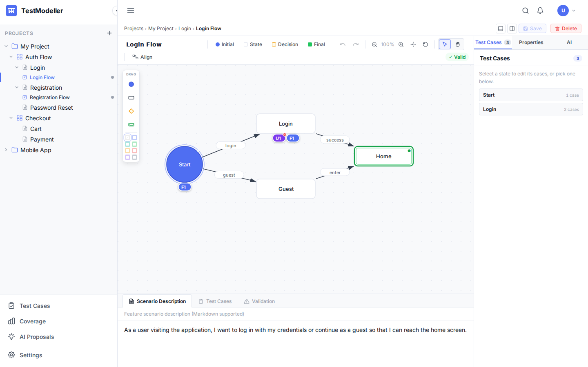

# TestModeller

Model-based testing: draw a model of how a feature behaves, and generate the
test cases that cover it. States and transitions go on a canvas, test cases
hang off the states they exercise, and an AI assistant proposes both — nothing
it proposes is saved until you accept it.



**[Documentation](https://uid09552.github.io/testmodeller/)** ·
[Specification](docs/specification/) ·
[Decision records](docs/adr/) ·
[Agent guidance](AGENTS.md)

## What it does

- **Model a feature** as states and transitions, with guards and actions on the
  transitions, validated as you edit (one initial state, reachability, dead
  ends, expression errors).
- **Attach test cases to states** in Given/When/Then form, categorised as unit,
  integration or feature and marked positive or negative. Each state shows its
  counts on the canvas, so coverage is visible without opening anything.
- **Generate test cases from a model** against a coverage criterion,
  deterministically for a given model, criterion and seed.
- **Ask an AI assistant** for scenarios, test cases or the states a flow is
  missing. Proposals arrive as cards with a rationale; accepting one records it
  through the API and then applies it. Claude, Ollama and any
  OpenAI-compatible endpoint are supported, configured in `.env`.
- **See coverage** per model, feature and component, and export to JSON, CSV or
  Gherkin.

The [documentation](https://uid09552.github.io/testmodeller/) has a screenshot
tour.

## Running it

```bash
cp .env.example .env     # set POSTGRES_PASSWORD, TM_JWKS_URL, the OIDC_* values,
                         # and TM_AI_* for the AI provider
make up                  # builds and starts the gateway, frontend, backend and postgres
```

The app is on <http://localhost:8088>, served by an APISIX gateway. The gateway
is the only published port: it performs the OIDC handshake and attaches the
access token the backend validates, so neither the SPA nor the API is reachable
without signing in (see
[08 User management](docs/specification/08-usermanagement.md)). To connect your
identity provider and map the tenant and role claims, including nested ones
like `edge.siemens.cloud.tenant`, follow
[Configuring authentication](docs/guides/authentication-setup.md).

### Developing

```bash
make dev      # backend + throwaway database (needs Docker); JWT validation off
make dev-fe   # Angular dev server on :4200, proxied to the backend
```

`--dev-mode` skips JWT validation and treats every request as an `Editor` in
the `dev` tenant, so no identity provider is needed to develop. `make dev` does
not read `.env`; pass the AI provider on the command line:

```bash
TM_AI_PROVIDER=ollama TM_AI_MODEL=llama3.1 make dev
```

| Target | What it does |
| --- | --- |
| `make dev` / `make dev-fe` | Run the backend / the Angular dev server |
| `make check` | `cargo fmt --check` and `cargo clippy -D warnings` |
| `make test` | Backend unit and doc tests |
| `make test-fe` | Frontend unit tests |
| `make build-fe` | Production build of the Angular app |
| `make screenshots` | Regenerate the documentation screenshots |
| `make up` / `make down` | Start / stop the container stack |
| `make logs` / `make ps` | Follow logs / show container status |
| `make down-volumes` | Stop the stack and delete the database volume |

## Layout

```
.
├── AGENTS.md                  # Entry point for AI agents
├── .github/
│   ├── workflows/             # CI, and the GitHub Pages deployment
│   ├── agents/                # Custom agents
│   ├── instructions/          # File-scoped instructions
│   ├── prompts/               # Reusable prompts
│   └── skills/                # Development skills
├── docs/                      # Published to GitHub Pages
│   ├── index.md               # Documentation home
│   ├── specification/         # What to build (openapi.yaml is the contract)
│   ├── architecture/          # How it is built
│   ├── guides/                # Coding and workflow guides
│   ├── adr/                   # Architecture decision records
│   └── screenshots/           # Generated; see make screenshots
├── backend/                   # Rust workspace
│   └── crates/{domain,generation,ai,storage,api}
├── frontend/                  # Angular app
└── gateway/                   # APISIX config (OIDC handshake, routing)
```

## Contributing

Read the [workflow guide](docs/guides/workflow.md) first. Two rules matter more
than the rest:

1. **Specification first.** Change the relevant file in `docs/specification/`
   in the same commit as the code.
2. **The API contract is fixed.** `docs/specification/openapi.yaml` is the
   source of truth and is not changed without agreement; backend and frontend
   implement it as written.

Before opening a pull request: `make check`, `make test`, `make test-fe`. If
the change is visible in the UI, `make screenshots` too, so the documentation
does not drift.

## Status

The backend implements the specification: the full API, test generation, AI
proposals, JWT validation and tenant separation.

The frontend is further behind the contract than it looks. The editor, the
projects tree and the test cases work, but against the browser's
`localStorage` rather than the API; the AI assistant and Settings call the real
API; the coverage dashboard and the proposals list still show placeholder data.
Moving the editor onto the API is the next substantial piece of work, and needs
no change to the contract. The
[documentation](https://uid09552.github.io/testmodeller/#status) has the
breakdown.

## Licence

None yet: `Cargo.toml` still says `UNLICENSED`, so the code is all rights
reserved and nobody may redistribute it. Publishing it as open source means
choosing a licence first, adding a `LICENSE` file and updating the workspace
metadata to match.
