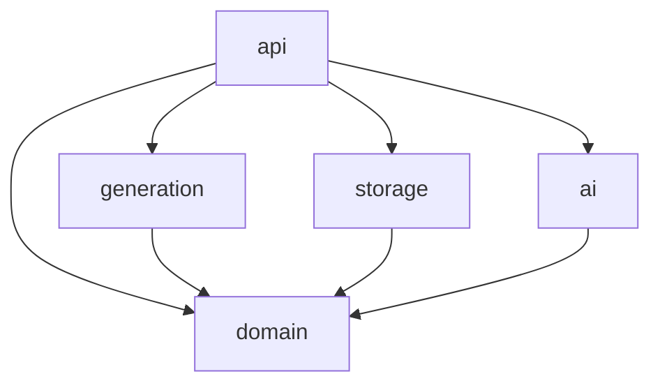

# Architecture overview

## Backend crates

| Crate | Responsibility |
| --- | --- |
| `domain` | Entities, validation, expression language. No I/O. |
| `generation` | Coverage-based test generation |
| `storage` | Repository traits + SQLite (sqlx) implementation |
| `ai` | Provider trait, prompts, response validation |
| `api` | axum HTTP server, DTOs, wiring, config |

## Frontend
Angular app: `core` (API client, auth/config), `shared` (UI kit), `features/{explorer,editor,test-cases,coverage,ai,settings}`.

## Cross-cutting
- Config via environment (`TM_` prefix) and optional config file.
- Logging/tracing via `tracing`.
- Migrations in `backend/crates/storage/migrations`.
