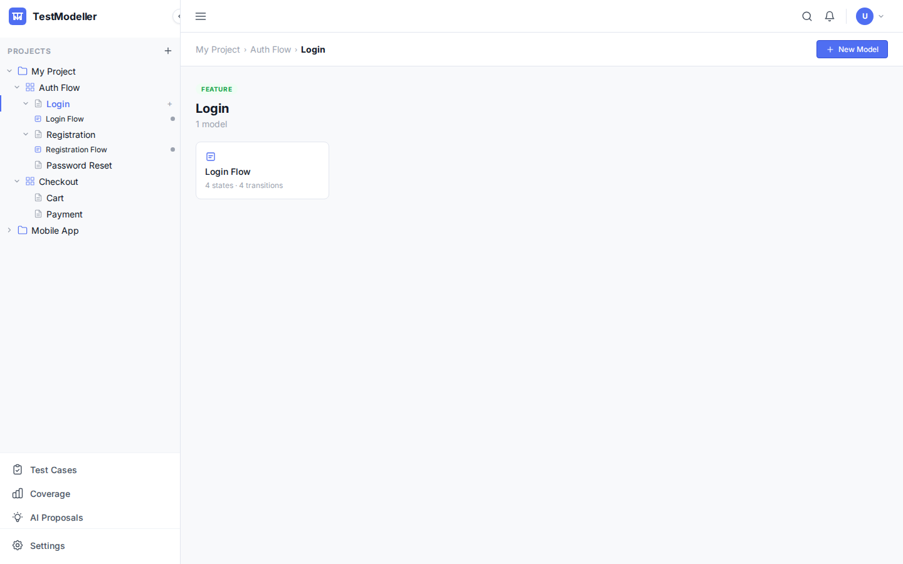
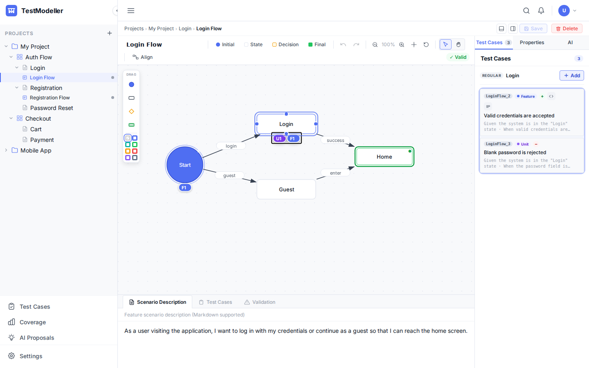
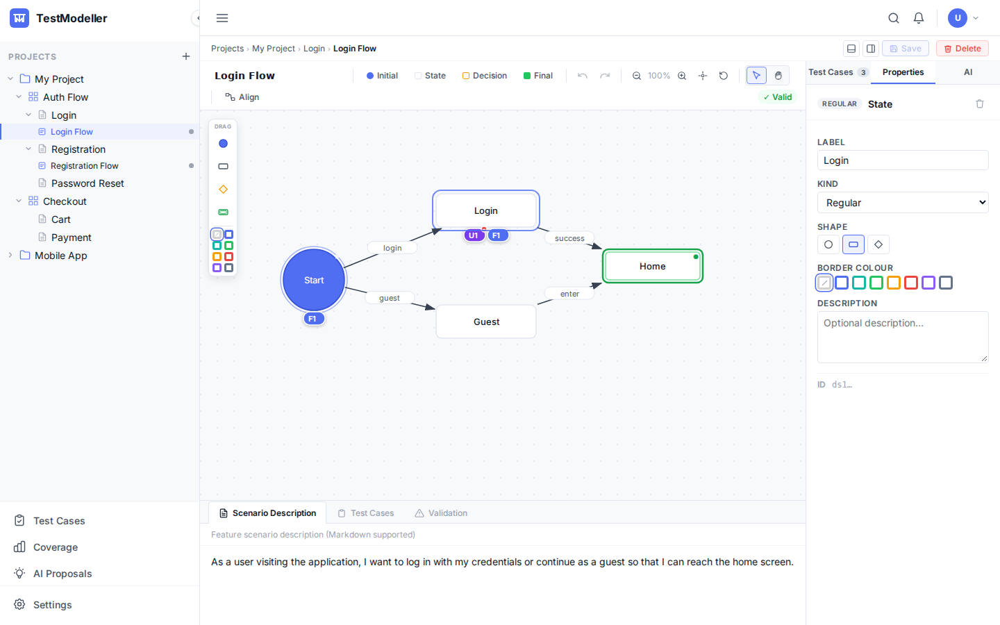
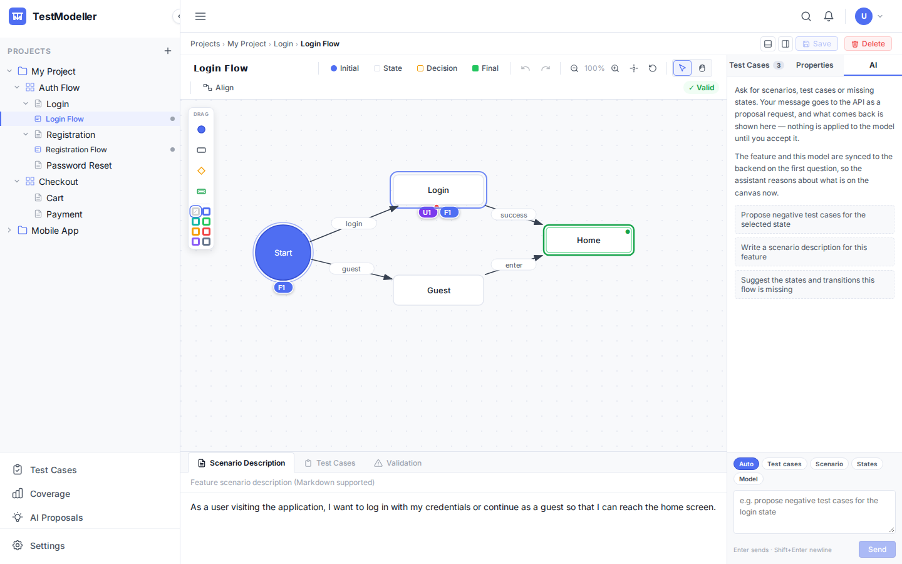
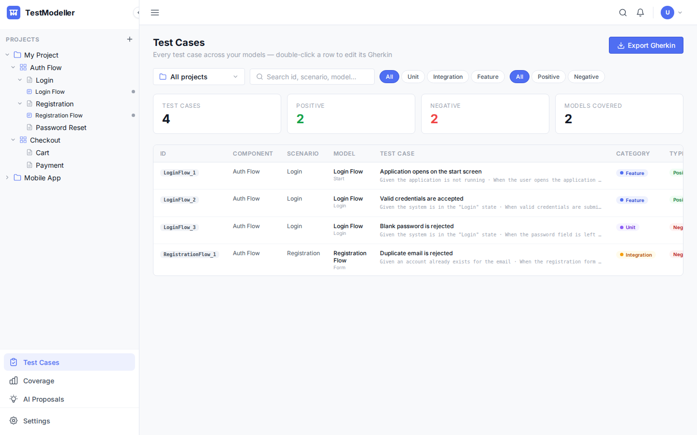
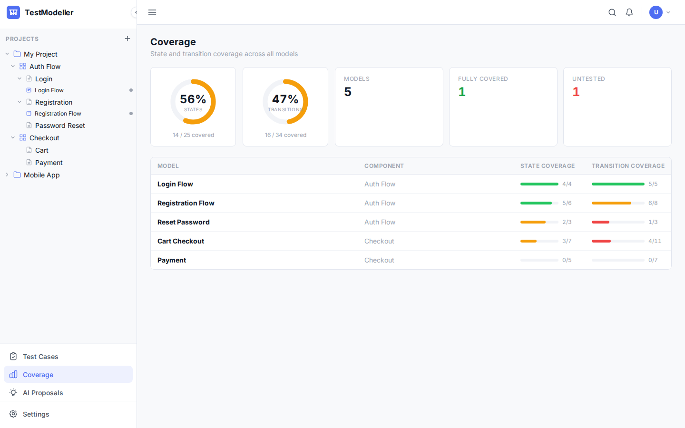
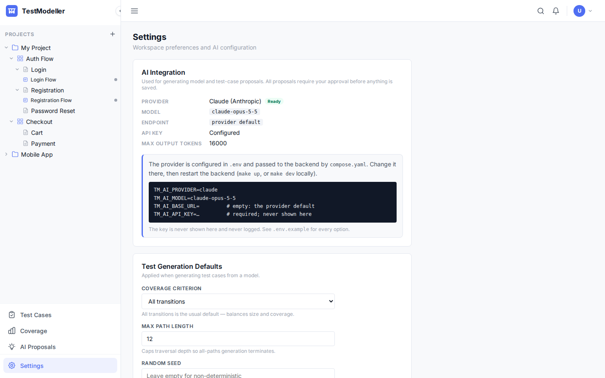

# TestModeller

Model-based testing: draw a model of how a feature behaves, and generate the
test cases that cover it. States and transitions go on a canvas, test cases
hang off the states they exercise, and an AI assistant proposes both — nothing
it proposes is saved until you accept it.


- **Source**: <https://github.com/uid09552/testmodeller>
- **Getting started**: [Running it](#running-it)
- **Concepts**: [Glossary](specification/01-glossary.md) · [Domain model](specification/02-domain-model.md)

## A tour

### Projects, components, features, models

The tree lives in the nav bar, so it is there on every screen. A project holds
components, a component holds features, and a feature holds the models that
describe it. Clicking a model opens it in the editor; clicking anything else
shows its detail.



### The model editor

The canvas holds states and transitions. Each state carries a chip per test
category — `U`nit, `I`ntegration, `F`eature — with the number of cases in it
and a dot when one of them is negative, so coverage is visible without opening
anything. Double-click the chips to jump to that state's cases.

Select and pan are the two canvas tools (`V` and `H`); double-clicking empty
space centres the diagram.

### Test cases

Test cases are the editor's default right-hand tab. With a state selected it
edits that state's cases in Given/When/Then form; with nothing selected it
shows which states are covered.



### Properties

The Properties tab edits whatever is selected — a state, a transition, a group
or the model itself — including guards and actions on transitions.



### The AI assistant

Ask for scenarios, test cases or the states a flow is missing. Each answer
comes back as a proposal card with its rationale and the model that produced
it. Accepting one records the acceptance through the API and then applies it;
rejecting one leaves no trace. Nothing is applied on its own.



See [AI integration](specification/07-ai-integration.md) for the providers —
Claude, Ollama or any OpenAI-compatible endpoint — and how keys are handled.

### Test cases across the project

Every case in one table, filterable by category, with its state and its
Gherkin steps.



### Coverage

What the test cases cover, per component, feature and model, and what they do
not.



The figures in this screenshot are placeholders: the dashboard is not wired to
`GET /coverage` yet. See [Status](#status).

### Settings

Shows the AI provider in effect — Claude, Ollama or any OpenAI-compatible
endpoint — and how to change it. The provider is configured in `.env`, not in
the UI:

```bash
TM_AI_PROVIDER=ollama
TM_AI_MODEL=llama3.1
TM_AI_BASE_URL=http://host.docker.internal:11434/v1   # Ollama on this machine
```



## Running it

```bash
cp .env.example .env     # set POSTGRES_PASSWORD, TM_JWKS_URL and the OIDC_* values
make up                  # gateway, frontend, backend and postgres
```

The app comes up on <http://localhost:8088>, behind an APISIX gateway that does
the OIDC handshake. For development without an identity provider:

```bash
make dev      # backend against a throwaway database, JWT validation off
make dev-fe   # Angular dev server on :4200, proxied to the backend
```

See [User management](specification/08-usermanagement.md) for what `--dev-mode`
skips and why, and [Configuring authentication](guides/authentication-setup.md)
to connect your identity provider, including where the tenant and role sit in
its tokens.

## Documentation

### Specification
- [00 Overview](specification/00-overview.md)
- [01 Glossary](specification/01-glossary.md)
- [02 Domain model](specification/02-domain-model.md)
- [03 Requirements](specification/03-requirements.md)
- [04 Test generation](specification/04-test-generation.md)
- [05 API](specification/05-api.md) — the contract is
  [openapi.yaml](specification/openapi.yaml)
- [06 UI](specification/06-ui.md)
- [07 AI integration](specification/07-ai-integration.md)
- [08 User management](specification/08-usermanagement.md)

### Architecture
- [Architecture overview](architecture/overview.md)
- [Decision records](adr/README.md)

### Guides
- [Configuring authentication](guides/authentication-setup.md)
- [Rust coding guide](guides/rust-coding-guide.md)
- [Angular coding guide](guides/angular-coding-guide.md)
- [Testing guide](guides/testing-guide.md)
- [Workflow](guides/workflow.md)

## Status

The backend implements the specification: the full API, test generation, AI
proposals, JWT validation and tenant separation, with unit tests over the
domain, generation, parsing and authorisation logic.

The frontend reads and writes everything through the API; nothing is kept in
the browser. The remaining gaps:

| Area | State |
| --- | --- |
| Projects tree, model editor, test cases | Stored through the API only (ADR 0008). Shapes, colours, sizes, groups and edge curves are not in the contract, so they reset on reload |
| AI assistant | Working. Saves the open model first, then asks (ADR 0008) |
| Settings | Read-only view of the provider configured in `.env` |
| Coverage dashboard, AI proposals list | Placeholder data; not wired to the API |
| Test case list | Real, read through the API |

## Contributing

Read the [workflow guide](guides/workflow.md) first. Two rules matter more than
the rest:

1. **Specification first.** Change the relevant file in `specification/` in the
   same commit as the code.
2. **The API contract is fixed.** `openapi.yaml` is the source of truth and is
   not changed without agreement; both sides implement it as written.

The screenshots on this page are generated, not hand-captured — see
[screenshots/README.md](screenshots/README.md) — so re-run them when the UI
changes rather than letting them drift.
