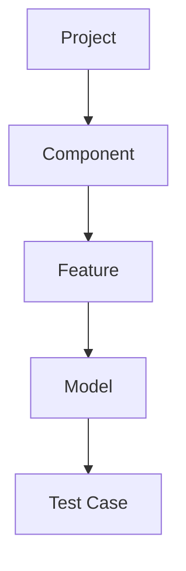
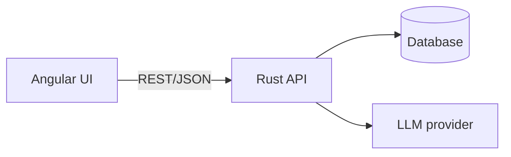
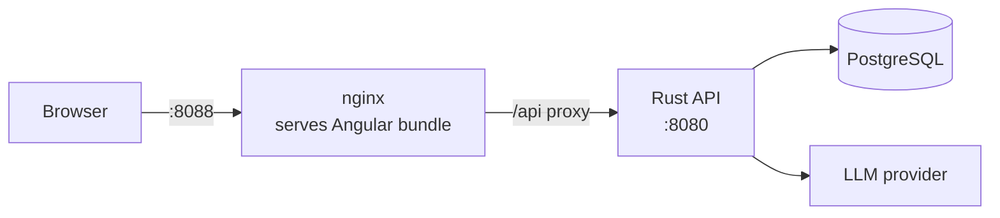

# Overview

## Purpose
TestModeller supports model-based testing: testers describe features by scenario descriptions, model behavior as state machines (models), organize them by feature and component, and generate test cases from the models. An AI assistant proposes models, model completions and test cases for review.

## Users
- Test engineer: models features, generates and exports test cases.
- QA lead: reviews coverage per feature/component.
- Developer: consumes exported test cases.

## Scope (v1)
- Model editing (state machines) in a graphical editor
- Organization: Component -> Feature -> Model, with test cases per feature assigned to model states/transitions
- Test case generation with coverage criteria
- AI proposals (models, transitions, test cases) with review workflow
- Export (JSON, CSV, Gherkin)

## Out of scope (v1)
- Test execution / automation runners
- Multi-tenant SaaS, SSO
- Real-time collaborative editing

## Hierarchy



Test cases belong to a feature and are assigned to states/transitions of its models.

## System context



## Deployment

The stack ships as three containers, defined in `compose.yaml` at the repository
root. See [ADR 0002](../adr/0002-container-deployment.md) for the reasoning.



| Container | Image base | Role |
| --- | --- | --- |
| `frontend` | `nginx:1.27-alpine` | Serves the built Angular bundle; reverse-proxies `/api` to the backend |
| `backend` | `debian:bookworm-slim` | The `testmodeller` binary; applies embedded migrations on startup |
| `db` | `postgres:16-alpine` | Persistence, on a named volume |

The browser talks to a single origin, so CORS is not involved on the normal
path. `TM_CORS_ORIGIN` only matters when calling the published backend port
directly.

### Running it

```bash
cp .env.example .env     # set POSTGRES_PASSWORD
make up                  # or: docker compose up --build -d
```

The app is then on <http://localhost:8088>. `make down` stops the stack and
keeps the database volume; `make down-volumes` deletes it.

### Configuration

All backend settings use the `TM_` prefix (see `backend/crates/api/src/config.rs`).
`.env.example` documents what compose reads. Two constraints:

- `POSTGRES_PASSWORD` is required — compose refuses to start without it rather
  than falling back to a default.
- `TM_AI_API_KEY` is supplied as runtime environment only and is never baked
  into an image, preserving the in-memory-only handling described in
  [07-ai-integration.md](07-ai-integration.md).

`--dev-mode` is not used in containers: it starts a throwaway database through
testcontainers and would need a Docker socket inside the container. For a
throwaway database during development, use `make dev` on the host instead.
