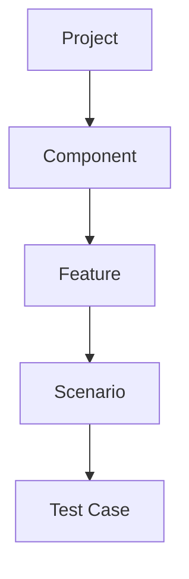
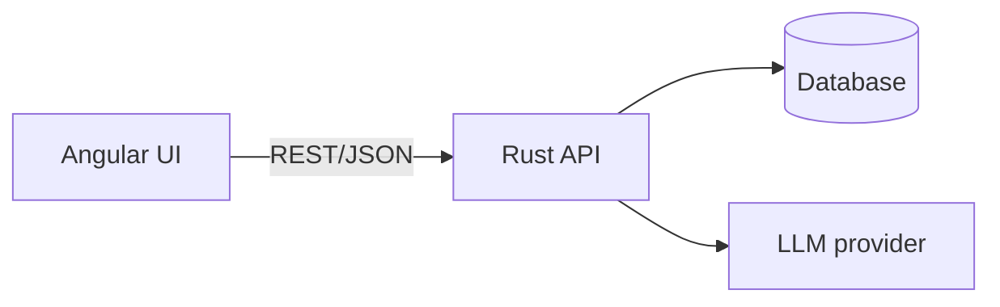

# Overview

## Purpose
TestModeller supports model-based testing: testers model system behavior as scenarios, organize them by feature and component, and generate test cases from the models. An AI assistant proposes scenarios, model completions and test cases for review.

## Users
- Test engineer: models scenarios, generates and exports test cases.
- QA lead: reviews coverage per feature/component.
- Developer: consumes exported test cases.

## Scope (v1)
- Scenario modelling (state machines) in a graphical editor
- Organization: Component -> Feature -> Scenario
- Test case generation with coverage criteria
- AI proposals (scenarios, transitions, test cases) with review workflow
- Export (JSON, CSV, Gherkin)

## Out of scope (v1)
- Test execution / automation runners
- Multi-tenant SaaS, SSO
- Real-time collaborative editing

## Hierarchy

Features may belong to one component; scenarios may be linked to additional features (many-to-many via tags/links).

## System context

