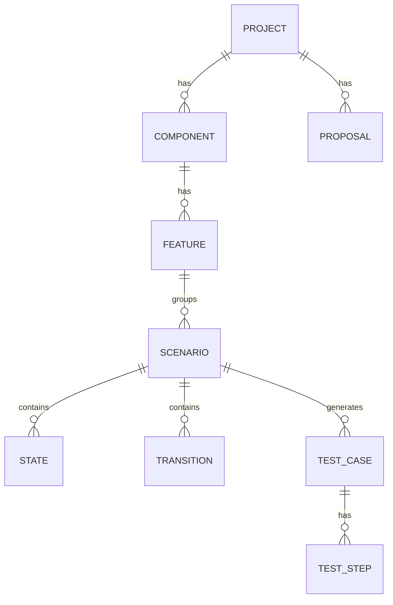

# Domain model

## Entities

All entities: `id` (UUID), `name`, `description`, `createdAt`, `updatedAt`, `version`.

- **Project**
- **Component**: `projectId`
- **Feature**: `componentId`, `tags[]`
- **Scenario**: `featureId`, `linkedFeatureIds[]`, `initialStateId`, `variables[]`, `status` (draft|ready)
- **State**: `scenarioId`, `kind` (normal|initial|final), `position {x,y}`
- **Transition**: `from`, `to`, `event`, `guard?`, `action?`, `expected?`
- **TestCase**: `scenarioId`, `criterion`, `seed`, `steps[]`, `coveredTransitionIds[]`, `origin` (generated|ai|manual)
- **TestStep**: `order`, `transitionId`, `action`, `expected`
- **Proposal**: `kind` (scenario|transition|testCase), `payload` (JSON), `status` (pending|accepted|rejected), `rationale`, `source` (model id)

## Invariants
- A scenario has exactly one initial state.
- Transitions reference states of the same scenario.
- Deleting a component/feature requires it to be empty or cascades explicitly.
- Guards/actions use the expression language defined in `04-test-generation.md`.
