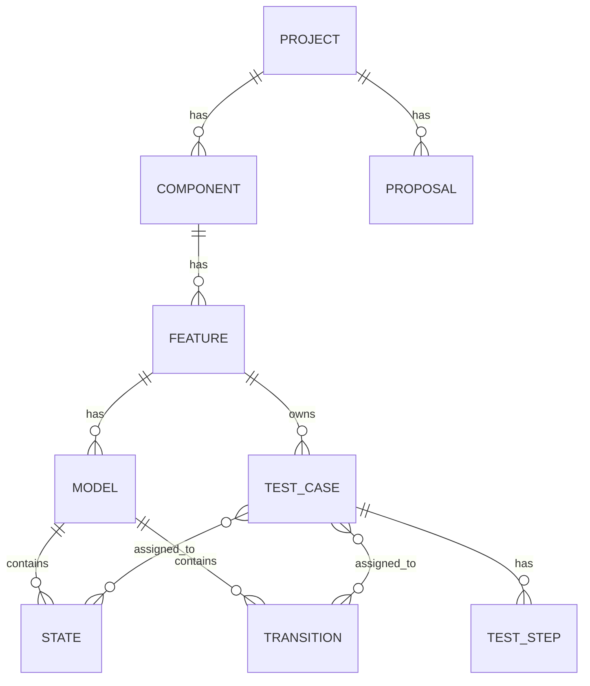

# Domain model

## Entities

All entities: `id` (UUID), `name`, `description`, `createdAt`, `updatedAt`, `version`.

- **Project**
- **Component**: `projectId`
- **Feature**: `componentId`, `scenarioDescription` (markdown text describing the scenarios), `tags[]`
- **Model**: `featureId`, `variables[]`, `status` (draft|ready); a state machine formerly called "scenario"
- **State**: `modelId`, `kind` (normal|initial|final), `position {x,y}`
- **Transition** (model step): `modelId`, `from`, `to`, `event`, `guard?`, `action?`, `expected?`
- **TestCase**: `featureId`, `steps[]`, `status`, `priority`, `tags[]`, `origin` (manual|generated|ai), `generatedFromModelId?`
- **TestStep**: `order`, `action`, `expected`
- **Assignment**: links a TestCase to a State or Transition (optionally a test step) of a Model of the same feature
- **Proposal**: `kind`, `payload` (JSON), `status` (pending|accepted|rejected), `rationale`, `source` (LLM id)

## Invariants
- A model has exactly one initial state.
- Transitions reference states of the same model.
- A test case may be assigned to many states/transitions, only within models of its own feature.
- Deleting a model or state/transition removes its assignments, never the test cases.
- Deleting a component/feature requires it to be empty or cascades explicitly.
- Guards/actions use the expression language defined in `04-test-generation.md`.
