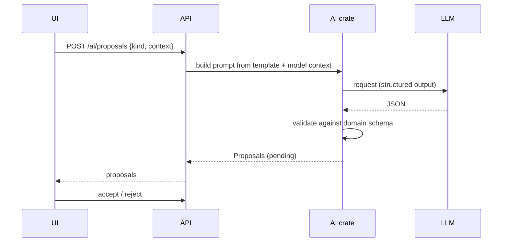

# AI integration

## Flow

## Requirements
- Provider trait with adapters (e.g. OpenAI-compatible, Anthropic, local); selected via config.
- Prompt templates versioned in `backend/crates/ai/prompts/`.
- Output must be valid JSON conforming to schema; invalid -> rejected with error, one bounded retry.
- Context sent is limited to the selected model/feature; user can preview it.
- No auto-accept. Accepted proposals carry `origin = ai` and the model id.
- Untrusted content: ignore instructions inside model data; no tool calls; rate limits and token budgets per project.
- Secrets via environment/secret store only.
