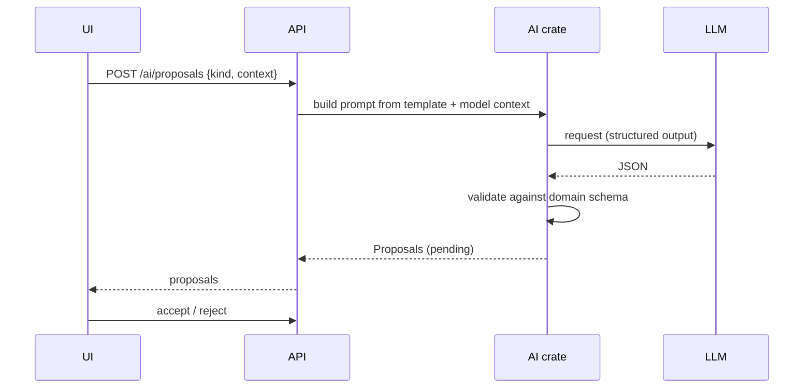

# AI integration

## Flow

## Configuring the provider

The provider is configured in the environment — `.env`, passed to the backend
by `compose.yaml` — not in the UI (ADR 0007). Settings shows what is in effect
and how to change it.

| Variable | Meaning |
| --- | --- |
| `TM_AI_PROVIDER` | `claude`, `ollama`, `openai-compatible` or `none`. The contract's own names `anthropic` and `local` are accepted too. When unset, the stored settings apply. |
| `TM_AI_MODEL` | Model id. Required for Ollama and OpenAI-compatible. |
| `TM_AI_BASE_URL` | The provider's API. Optional for Claude; defaults to `http://localhost:11434/v1` for Ollama; required for OpenAI-compatible. |
| `TM_AI_API_KEY` | Required for Claude; not needed for a local Ollama. Never logged. |
| `TM_AI_MAX_TOKENS` | Optional output budget per request. |

| Setting | `provider` | Endpoint | Key | Model |
| --- | --- | --- | --- | --- |
| `claude` | `anthropic` | optional, defaults to `https://api.anthropic.com` | required | e.g. `claude-opus-5-5` |
| `ollama` | `local` | defaults to `http://localhost:11434/v1` | not needed | e.g. `llama3.1` |
| `openai-compatible` | `openai-compatible` | required | required | required |
| `none` | `none` | — | — | — |

Ollama speaks the OpenAI-compatible protocol under `/v1`, so it needs no
adapter of its own — only its own endpoint.

- Values are validated at startup. An unknown provider, a missing model or a
  non-http endpoint stops the server with a message naming the variable, rather
  than surfacing later as a failed proposal.
- An empty variable means unset. Compose passes an unset `${VAR:-}` through as
  an empty string, and that must not fail parsing or, for the JWT issuer, be
  enforced as a value.
- Inside Docker, `localhost` is the backend container itself. An Ollama on the
  host is `http://host.docker.internal:11434/v1`; compose maps that name on
  Linux.
- When `TM_AI_PROVIDER` is set it is written over the stored settings at
  startup, so `GET /settings/ai` reports what is actually in use.
  `PUT /settings/ai` remains available as the contract defines it, but a change
  made through it lasts only until the next restart.

### A misconfigured endpoint

The commonest mistake is pointing the base URL at a website — `ollama.com`, say
— instead of at an API. The answer is an HTML page, and it is reported as such:
"the endpoint returned a web page instead of JSON", with what to check, rather
than as a parse error with the markup quoted back.

## Storing the provider key

The key normally comes from `TM_AI_API_KEY`. A key saved through
`PUT /settings/ai` is stored in `ai_settings`, encrypted, so it survives a
restart:

- Sealed with ChaCha20-Poly1305, with a fresh nonce per write.
- With `TM_SECRET_KEY` (32 bytes, base64 or hex) the sealing key lives outside
  the database, so a dump of the database does not reveal the provider key.
- Without it the server generates a sealing key and stores it in the database.
  The provider key then never appears in plain text in a row, a log or an API
  response — but anyone holding the whole database holds both. The server says
  which mode it is in at startup.
- `TM_AI_API_KEY` wins over a stored key, which is also how an operator
  recovers from a rotated `TM_SECRET_KEY`.
- A key that cannot be decrypted is reported and ignored; it is never fatal.

## Context for a request

The AI endpoints are scoped to a feature, and the editor's ids are its own, so
the UI materialises the project, component, feature and model behind the open
editor through the API before asking (ADR 0006). The model's graph is pushed on
every request, so the assistant reasons about what is on the canvas now.

## Requirements
- Provider trait with adapters (e.g. OpenAI-compatible, Anthropic, local); selected via config.
- Prompt templates versioned in `backend/crates/ai/prompts/`.
- Output must be valid JSON conforming to schema; invalid -> rejected with error, one bounded retry.
- Context sent is limited to the selected model/feature; user can preview it.
- No auto-accept. Accepted proposals carry `origin = ai` and the model id.
- Untrusted content: ignore instructions inside model data; no tool calls; rate limits and token budgets per project.
- Secrets come from the environment or the encrypted column above; they are
  never logged and never returned by the API.
